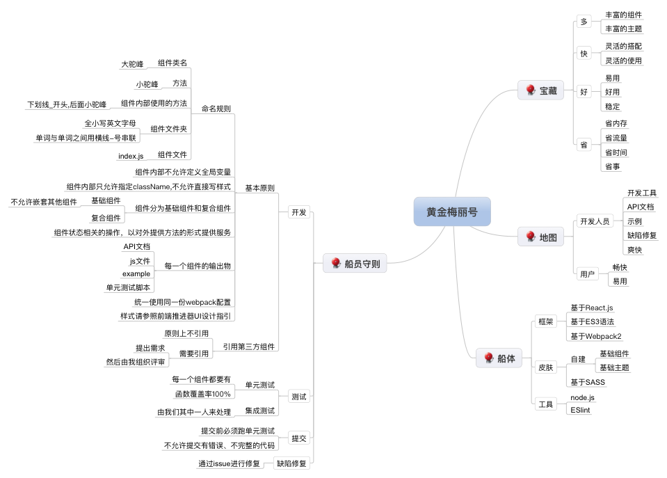

# 黄金梅丽号 Going Merry
黄金梅丽号 Going Merry是基于React.js V15.5.4进行开发的，支持双向数据绑定的组件化前端库，兼容IE9+，Chrome，Safari，Firefox。
***
## 项目目录结构说明
- **dist**

    - **assets** &nbsp&nbsp移动版UI静态资源库，包括css、font、images
	- **ucsmy-mui.js** &nbsp&nbsp移动版UI组件库的UMD(Universal Module Definition)发布版本，未压缩版本，适用于开发模式下，方便调试。
	- **ucsmy-mui.min.js**  &nbsp&nbsp移动版UI组件库的UMD(Universal Module Definition)发布版本，压缩版本，生产上建议使用压缩版来提高加载效率。
	- **libs** &nbsp&nbsp组件库依赖的基础类库，生产上建议使用压缩版来提高加载效率，包括react.js、react.min.js、react-dom.js、react-dom.min.js、u-ajax.js、u-ajax.min.js、u-eventhub.js、u-eventhub.min.js
	
- **api**
	
	UI组件的API说明文档。
	
- **examples**
	
	UI组件的使用示例，包括可运行示例，每一个组件都有一个示例。
	
- **sass**
	
	UI组件示例所用到的css样式源码。

- **src**

	UI组件的组件源码。

- **src-examples**

	UI组件的使用示例源码。
	
***

## 使用说明

UI组件库在运行时，会创建一个全局对象，对象名称为**UcsmyUI**，所有的组件都包含在此对象中。

### H5页面标准配置：

```
<!DOCTYPE html>
	<html lang="zh-CN">
	<head>
	    <meta charset="utf-8">
	    <meta http-equiv="X-UA-Compatible" content="IE=edge">
	    <meta name="description" content="">
	    <meta name="keywords" content="">
	    <meta name="viewport" content="width=device-width,initial-scale=1">
	    <meta name="renderer" content="webkit">
	    <meta http-equiv="Cache-Control" content="no-siteapp">
	    <meta name="mobile-web-app-capable" content="yes">
	    <meta name="apple-mobile-web-app-capable" content="yes">
	    <meta name="apple-mobile-web-app-status-bar-style" content="black">
	    <meta name="apple-mobile-web-app-title" content="">
	    <meta name="msapplication-TileColor" content="#0e90d2">
	     <title>xxxx</title>
	 </head>
	 <body>
	 		<div id="merry"></div>
	 </body>
 </html>  
 
```

### 引用：
1.在页面引用基础类库文件。

```
<script type="text/javascript" src="../../dist/libs/react.min.js"></script>
<script type="text/javascript" src="../../dist/libs/react-dom.min.js"></script>
<script type="text/javascript" src="../../dist/libs/u-eventhub.js"></script>
<script type="text/javascript" src="../../dist/libs/u-ajax.js"></script>
```

2.引用组件样式文件。

```
<link rel="stylesheet" href="../../dist/assets/css/app.css">
```

3.如果使用UMD的方式，则需引入ucsmy-mui.min.js这个组件库，才可以JavaScript脚本中使用UI组件。使用UMD的方式的优点在于组件全量更新，缺点是全量加载。

```
<script type="text/javascript" src="../../dist/ucsmy-mui.min.js"></script>
```
使用示例：

```
var Input = UcsmyUI.Input;
...

```
4.如果使用commonJS的方式，则无需引入ucsmy-mui.min.js这个组件库，在javascript中，直接通过require的方式引用组件。使用此种方式引用组件，可以实现组件按需加载，缺点是组件的更新需要同步编译生成所有有引用的页面。

```
var Input = require('./src/base/input');
```

### HTML完整示例

```
<!DOCTYPE html>
	<html lang="zh-CN">
	<head>
	    <meta charset="utf-8">
	    <meta http-equiv="X-UA-Compatible" content="IE=edge">
	    <meta name="description" content="">
	    <meta name="keywords" content="">
	    <meta name="viewport" content="width=device-width,initial-scale=1">
	    <meta name="renderer" content="webkit">
	    <meta http-equiv="Cache-Control" content="no-siteapp">
	    <meta name="mobile-web-app-capable" content="yes">
	    <meta name="apple-mobile-web-app-capable" content="yes">
	    <meta name="apple-mobile-web-app-status-bar-style" content="black">
	    <meta name="apple-mobile-web-app-title" content="">
	    <meta name="msapplication-TileColor" content="#0e90d2">
	    <title>xxxx</title>
	    <script type="text/javascript" src="../../dist/libs/react.min.js"></script>
		<script type="text/javascript" src="../../dist/libs/react-dom.min.js"></script>
		<script type="text/javascript" src="../../dist/libs/u-eventhub.js"></script>
		<script type="text/javascript" src="../../dist/libs/u-ajax.js"></script>
		<link rel="stylesheet" href="../../dist/assets/css/app.css">
	 </head>
	 <body>
	 		<div id="merry"></div>
	 </body>
 </html>
```

## 问题及支持

如果在使用的过程中，发现有问题或者希望我们提供新的组件时，请在ISSUE面板提交ISSUE，我们会在ISSUE上进行咨询答复，请按格式要求提交，谢谢。

- 问题

	【问题】xxx组件在xxx情况下有xxx问题
	
- 需求

	【需求】增加XXX功能组件
	
	【需求】XXX组件增加XXX功能
	
	【需求】XXX组件修改XXX功能
	
	【需求】XXX组件删除XXX功能
	
	【需求】删除XXX功能组件
	

## 开发规范
	
